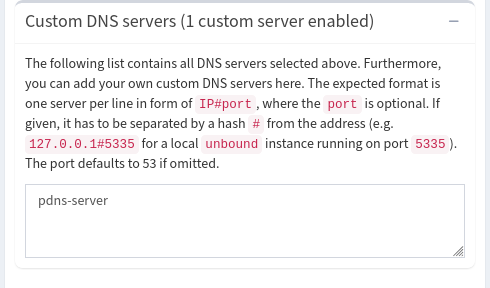
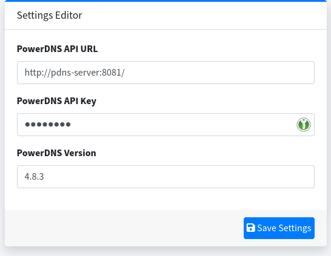

RogueDNS
========

.. contents:: Table of Contents

Disclaimer: this tool may only be used for legal purposes.

Screenshots
-----------

.. list-table:: Screenshots
   :class: borderless

   * - .. image:: images/pihole-dashboard.png
          :align: left
          :alt: Pihole dashboard
     - .. image:: images/powerdns-admin-dashboard.png
          :align: left
          :alt: PowerDns Admin dashboard

Quick start
-----------

Copy or rename .env.sample to .env. It is highly recommended to change default values for **FTLCONF_webserver_api_password** and **PDNS_API_KEY**.

Run in **test** mode:

.. code:: bash

   docker compose -f compose.yaml -f compose.dev.yaml up -d

URLs:

 ================= =========================
  description      URL
 ================= =========================
  Pihole           http://localhost/admin/
  PowerDns Admin   http://localhost:9191/
 ================= =========================

Introduction
------------

RogueDNS - a self-hosted DNS service based on Pihole and PowerDns.

Why this tool?
~~~~~~~~~~~~~~

The goal of this solution is to provide an **Internet-facing**, **authoritative** DNS service for your domain names, and collect **stats** about DNS clients (IP addresses and hostnames).

You can for example use this solution for hosting your **domain typos**, for targeted **phishing** campaigns, or just to spoof DNS replies.

Why not use a third party/free DNS service instead?
~~~~~~~~~~~~~~~~~~~~~~~~~~~~~~~~~~~~~~~~~~~~~~~~~~~

Because they will not provide you with the **IP addresses** of the DNS clients. By hosting your own DNS service, the DNS queries will come to you instead, and you will be able to see where the queries are coming from.

In theory, you could spoof the replies based on the client (not implemented yet).

What about other tools?
~~~~~~~~~~~~~~~~~~~~~~~

We can use tools like dnsmasq `dnsmasq <https://thekelleys.org.uk/dnsmasq/doc.html>`_ or `dnschef <https://github.com/iphelix/dnschef>`_ to spoof DNS replies. These tools work great inside local networks for **man in the middle** attacks, but are ill-suited for hosting domain names.

- For example, dnsmasq does not serve NS records natively
- dnschef does not handle multiple records really well
- Some domain registries have stringent requirements, or are just picky about TTL values

The best way to achieve a compliant setup is to use standard DNS server software. Other authoritative servers like Bind or Knot are equally fine.

Components
----------

- `Pihole <https://pi-hole.net/>`_ acts as a **forwarder** (uses dnsmasq) and is used solely to collect **stats** about DNS clients (IP addresses and hostnames)
- `PowerDns <https://github.com/PowerDNS/pdns>`_ server provides DNS service for your domain zones
- `PowerDns Admin <https://github.com/PowerDNS-Admin/PowerDNS-Admin>`_ provides a GUI to PowerDns server via **API**

Technically, the only essential service is PowerDns and the rest is for convenience.

Requirements
------------

Development/testing
~~~~~~~~~~~~~~~~~~~

- For **development/testing**, a computer running Docker is sufficient

Production
~~~~~~~~~~

- For **production** use, a small Linux VPS is fine, preferably with at least one IPv4 address and one IPv6 address
- Additionally, you should define at least one name server record eg ns1.yourdomain.com, that points to the correct IP address(es) for your live VPS. The actual domain name does not matter.

Some domain registries require at least two name servers hosted on separate subnets, with enough AS/address diversity, so the exact requirements will depend on the domain name extension(s) you use.

Configuration
-------------

- The solution is designed to work out of the box, however it is recommended to review and change the default password values in the .env files.
- PiHole should have one **forwarder**, which is the PowerDns container (pdns-server). This is the server that will answer all DNS queries. By default, PiHole use Google public resolvers.
- You need to create a user/password for PowerDns Admin. Just go to the login page and click the link "Create an account" to register

Running in Docker
-----------------

Start containers in dev mode:

.. code:: bash

   docker compose -f compose.yaml -f compose.dev.yaml up -d

Start containers in production mode:

.. code:: bash

   docker compose -f compose.yaml up -d

or simply:

.. code:: bash

   docker compose up

**Tip**: By default, Docker Compose reads two files, a compose.yaml and an optional compose.override.yaml file (`source <https://docs.docker.com/compose/how-tos/multiple-compose-files/merge/>`_).

So, you can conveniently run the solution in **dev mode** on your machine by simply renaming compose.dev.yaml to compose.override.yaml. Then, it is enough to execute :code:`docker compose` without further options. Run :code:`docker compose config` if in doubt.

API
---

You can use the PowerDNS **API** to populate the database. Below is an example that shows how to create a new zone in Python.

.. code:: python

    import requests
    from urllib.parse import urljoin
    
    session = requests.session()
    API_HOST = "http://127.0.0.1:8081/"
    API_KEY = "changeme"
    session.headers.update({"x-api-key": API_KEY})
    
    def populate_zone(domain):
        api_url = urljoin(API_HOST, "/api/v1/servers/localhost/zones")
        payload = {
            "name": f"{domain}.",
            "kind": "Native",
            "masters": [],
            "nameservers": [f"ns1.{domain}.com.", f"ns2.{domain}.com."],
            "rrsets": [
                # add some A records
                {"name": f"{domain}.", "type": "A", "ttl": 14400, "changetype": "REPLACE",
                "records": [{"content": "127.0.0.53", "disabled": False}]},
                {"name": f"ns1.{domain}.", "type": "A", "ttl": 86400, "changetype": "REPLACE",
                 "records": [{"content": "192.168.0.6", "disabled": False}]},
                {"name": f"ns2.{domain}.", "type": "A", "ttl": 86400, "changetype": "REPLACE",
                 "records": [{"content": "192.168.0.7", "disabled": False}]},
                {"name": f"mail.{domain}.", "type": "A", "ttl": 14400, "changetype": "REPLACE",
                "records": [{"content": "127.0.0.53", "disabled": False}]},
                # add some AAAA records
                {"name": f"{domain}.", "type": "AAAA", "ttl": 14400, "changetype": "REPLACE",
                "records": [{"content": "100::35cc", "disabled": False}]},
                # add MX
                {"name": f"{domain}.", "type": "MX", "ttl": 14400, "changetype": "REPLACE",
                "records": [{"content": f"10 mail.{domain}.", "disabled": False}]
                },
                # add wilcard
                {"name": f"*.{domain}.", "type": "A", "ttl": 14400, "changetype": "REPLACE",
                "records": [{"content": "127.0.0.53", "disabled": False}]},
                # add SOA
                {"name": f"{domain}.", "changetype": "REPLACE", "records": [
                {"content": f"ns1.{domain}. hostmaster.{domain}. 2025052001 10800 3600 604800 3600",
                 "disabled": False}], "ttl": 86400, "type": "SOA"}
            ]
        }
        result = session.post(api_url, json=payload)
        print(f"URL: {api_url}")
        print(f"Status: {result.status_code}")
        print(f"result: {result.text}")
    
    domain = "test.com"
    populate_zone(domain)

Client stats
------------

Client stats are recorded by **Pihole** to a SQLite database.
Tables/views of interests are:

- queries
- client_by_id

Troubleshooting
---------------

Docker is complaining that the port is already allocated
~~~~~~~~~~~~~~~~~~~~~~~~~~~~~~~~~~~~~~~~~~~~~~~~~~~~~~~~

If the port in question is 53, this is because you already have a DNS resolver running on your host. Either disable it, or modify the Docker compose file so as *not* to export port 53 on your host.
Instead, you can make queries to private Docker addresses rather than 127.0.0.1:

1. Use :code:`docker ps` to get the ID of the pdns-server container
2. Run :code:`docker inspect -f '{{range.NetworkSettings.Networks}}{{.IPAddress}}{{end}}' 57cff4d499be` where 57cff4d499be is container ID or name
3. This will return an IP address usually in the 172.x.x.x range
4. You can query the server using the private Docker address obtained eg: :code:`dig -t a <your domain> @172.20.0.2` where 172.20.0.2 is the IP address obtained from above. Or: :code:`nslookup <your domain> <server IP>`

The resolver is not working (timeout)
~~~~~~~~~~~~~~~~~~~~~~~~~~~~~~~~~~~~~

- Verify that port 53 is exposed on your host, or see above to use an addresss different than 127.0.0.1 for testing
- dnsmasq may refuse service if it has no **forwarders** available. Use the web interface and verify that there is at least one forwarder (it should be "pdns-server" by default and look like the picture below)

PowerDns Admin DB error on startup
~~~~~~~~~~~~~~~~~~~~~~~~~~~~~~~~~~

This error message can occur when using Docker bind mounts and is due to permission issues:

::

   sqlalchemy.exc.OperationalError: (sqlite3.OperationalError) unable to open database file

The post_start hook in compose.dev.yaml should fix that. This issue should not happen when using Docker volumes.

PowerDns Admin does not show any domain zones
~~~~~~~~~~~~~~~~~~~~~~~~~~~~~~~~~~~~~~~~~~~~~

Verify that the **API key** is properly set.  Also make sure to specify the correct **version**.
The configuration box should look like this:

The solution does not seem to be working as expected
~~~~~~~~~~~~~~~~~~~~~~~~~~~~~~~~~~~~~~~~~~~~~~~~~~~~

- Use :code:`docker compose logs` or use :code:`docker compose up` instead of :code:`docker compose up -d` to watch the *output* of your containers.
- Look inside the containers for additional **logs**.
- If necessary, you can modify the entrypoints to increase the **verbosity** of applications. For example, pdns_server has a :code:`--loglevel=<level>` option. Thus, :code:`--loglevel=7` should provide maximum verbosity.
- If you still can't get it right, file an issue in Github. Make sure to attach any relevant error messages, log entries etc. Specify any configuration changes you've made.

Security
--------

Before deploying this solution on an Internet-facing server, please note the following:

- This solution was designed for specific attack scenarios and may not be best-practice for production environments
- In order to minimize attack surface, you should only expose port 53/DNS (TCP and UDP)
- We recommend not to expose Pihole or PowerDNS Admin interfaces publicly - but you can (and should) use firewall rules to restrict access to IP addresses you own
- By default, Pihole and PowerDNS will reveal their version when queried for a specific TXT record: :code:`dig chaos txt version.bind @namesever`